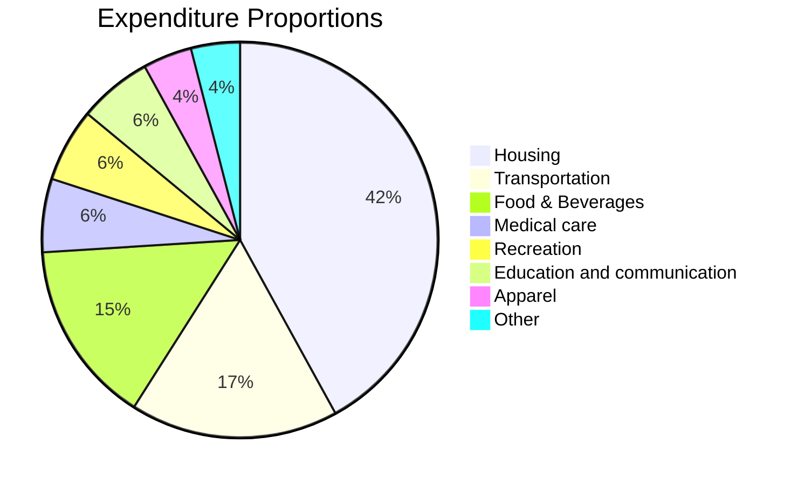
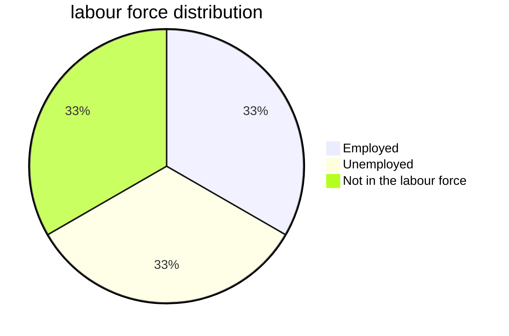
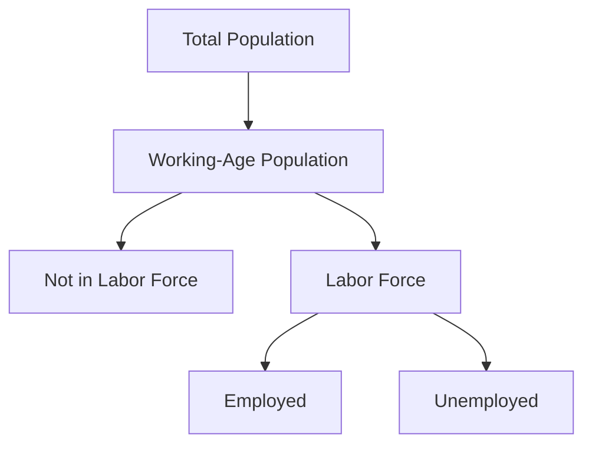
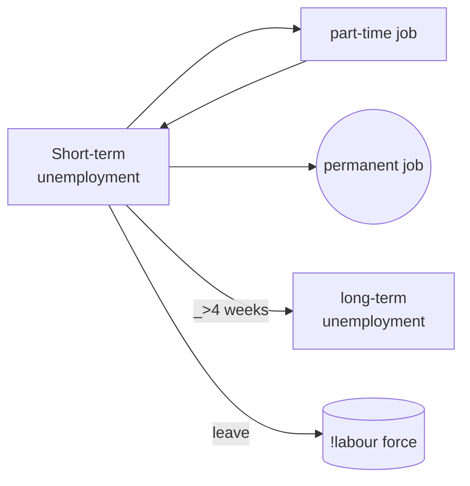
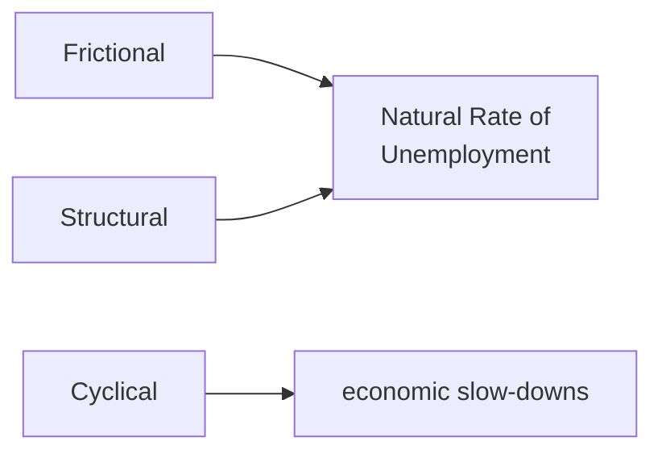
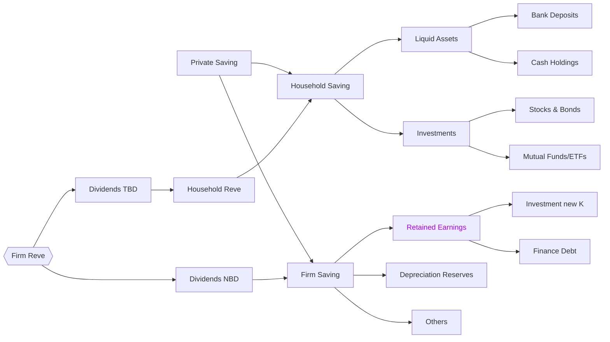
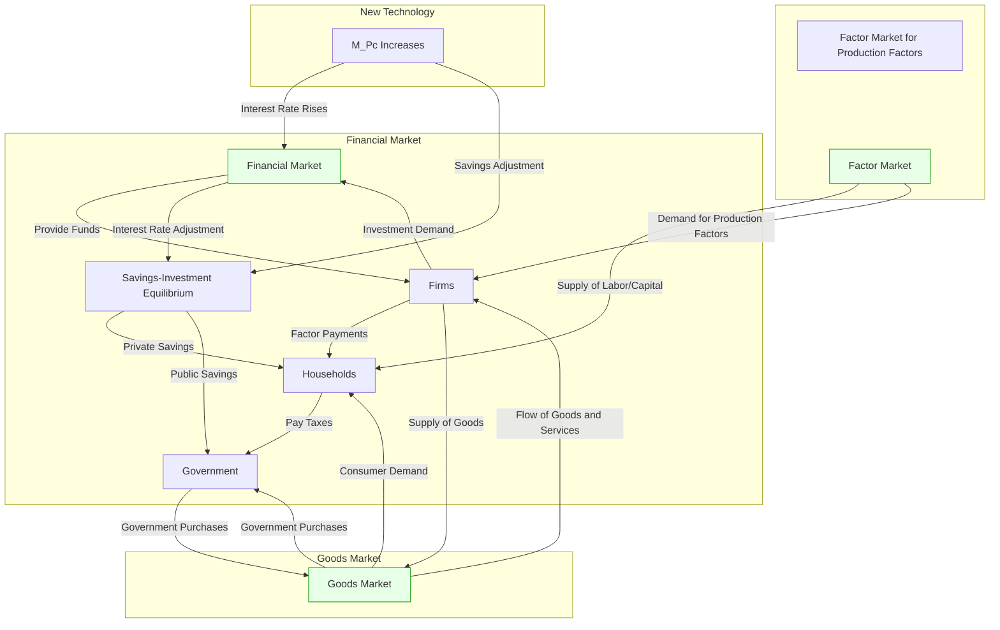
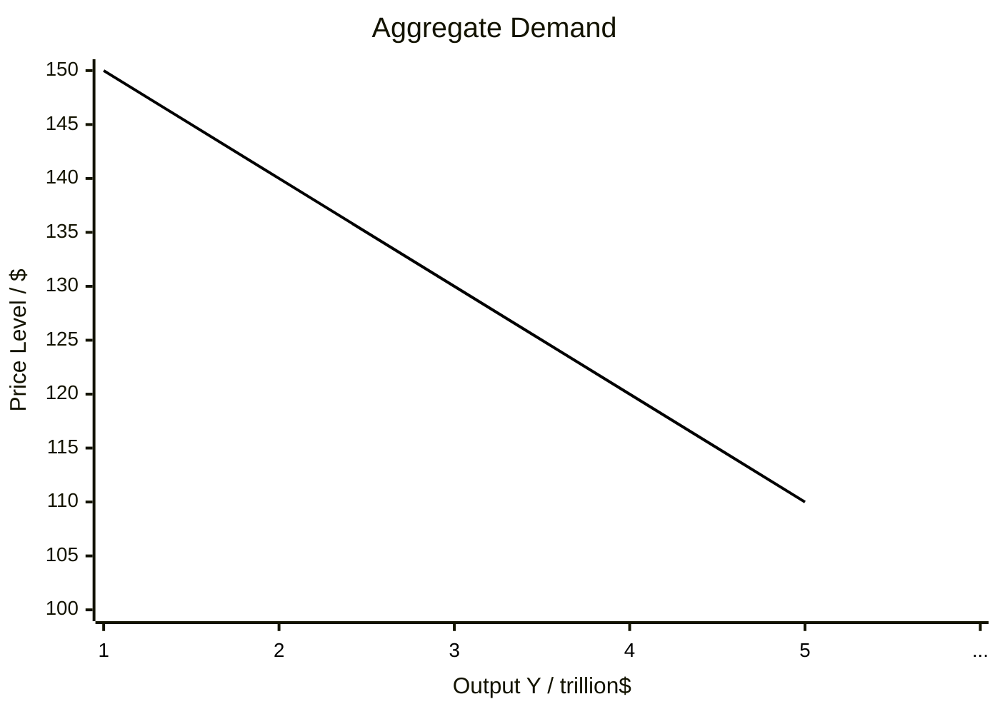

# Microeconomics

Free market: Market without government intervene
 Any operation from government results in a loss in market total revenue

Competitive market: Nobody can influence the market price
Competitive market: Nobody can influence the market price
1. Enough buyers

2. Enough homogeneous or identical products (narrow market)

3. Both sellers and buyers can enter and exit freely

## The law of demand

Whenever the price if a commodity rises, its quantity demanded will drop

## Market equilibrium

In competitive market, the market will enter the efficient status when the total surplus is maximized. Then both sellers and buyers have no incentives to change the quantity of commodity, so the price is fixed. But in uncompetitive market, equilibrium is not consistent with efficiency.

## Market failure

Market fails to achieve the status of efficiency when it tends to equilibrium.

Causes:
 Externalities, public goods, monopolies, or information asymmetries can cause markets to reach an equilibrium that is not efficient.

Externalities:
 if not all the behaviour made by participants are independent, the market equilibrium may not be the efficient system.flowchart LRflowchart LR

Elastic:
 Price elasticity of demand = ***Percentage*** change in quantity demanded

***Percentage*** change in price:
> [!PDF|yellow] [[Pindyck,Microeconomics.pdf#page=57&selection=105,29,134,1&color=yellow|Pindyck,Microeconomics, p.55]]
> > ite the price elasticity of demand as follows:7
> > Ep = ∆Q/Q ∆P/P = P∆Q Q∆P

The percentage change in quantity will always have the opposite sign as the percentage change in price, but we commonly omit the negative sign.

1.   Sufficient close substitute or not

2.   Necessary or luxury commodity

3.   Broad or narrow market

4.   Long or short term

Income Elasticity
> [!PDF|yellow] [[Pindyck,Microeconomics.pdf#page=59&selection=12,26,43,0&color=yellow|Pindyck,Microeconomics, p.57]]
> > I: $$E_I =  \frac{∆Q/Q}{∆I/I} = \frac{I}{Q}\frac{∆Q}{∆I}$$

 normal good : Income Elasticity > 0
 inferior good Ei < 0
Deadweight Loss(DWL)

Global loss without any parts of the systems benefits.(Systemic loss)

Factors: Tax and Subsidies, Price ceiling and floor

Batman loss: loss because of resulting price barrier by government
> [!PDF|yellow] [[Pindyck,Microeconomics.pdf#page=336&selection=147,0,147,29&color=yellow|Pindyck,Microeconomics, p.334]]
> > Welfare loss When Price modification/tax is held

Mask loss: loss because of government setting tariff when domestic market connecting to global market
> [!PDF|yellow] [[Pindyck,Microeconomics.pdf#page=354&selection=244,0,245,20&color=yellow|Pindyck,Microeconomics, p.352]]
> > import tariff or Quota (general Case)

Polity bind {

If a policy(e.g. tax) can influence or break the recent conditions of market(equilibrium), it is binding, or it is not binding.

}

Good {

Excludability: accessibility in consumption, It defines a good is private or public;

Rivalry: influenceability to other consumers. It defines a good is private or public;

}
> [!PDF|yellow] [[Mankiw, Gregory N., Principles of Economics, 9th .pdf#page=248&selection=81,0,85,19&color=yellow|Mankiw, Gregory N., Principles of Economics, 9th , p.248]]
> > Figure 1 Four Types of Goods

## Normal behaviour {

Maximize: Producers maximize their profits, Consumers maximize their utilities.

}

Preference (What a Consumer Wants){

Completeness: all accessible;

Transitivity: comparable;

Non-saturate: more is better;

Rationality: always maximize revenue;

}

Budget constraint(the bundles a consumer can afford){

x**Px** + y*Py* = Income

}

Indifferent curves(bundles with equivalent utility){

MRS(Marginal Rate of Substitution){

   Can be represented by the slope of the indifferent curve.

}

Utility(an abstract measure of the satisfaction or happiness that a consumer receives from a bundle of goods){

}

}

Optimization(consumers actually do){

   Use simultaneous equation of indifferent curve and budget constraint.

   If(we find a indifferent curve to be the tangent line of budget constraint){
The point = internal solution of optimization

}else{

The point will be the intersect point between the indifferent curve and budge constraint where the point is on the X or Y axis, no matter the curve is tangential or not. )

}

}

The demand and supply relationship with cost{

   The law of cost{

 At first, the marginal cost(MC) tends to fall as the production scale up; After a critical point, MC tends to rise due to the cost of management.

}

> [!PDF|yellow] [[Pindyck,Microeconomics.pdf#page=385&selection=80,0,80,30&color=yellow|Pindyck,Microeconomics, p.383]]
> > Lerner Index of Monopoly Power

> [!PDF|yellow] [[Pindyck,Microeconomics.pdf#page=385&selection=116,4,117,10&color=yellow|Pindyck,Microeconomics, p.383]]
> > index of monopoly power can also be expressed in terms of the elasticity of demand

> [!PDF|yellow] [[Pindyck,Microeconomics.pdf#page=120&selection=183,0,194,1&color=yellow|Pindyck,Microeconomics, p.118]]
> > MUF/PF = MUC/Pc
> [!PDF|red] [[Pindyck,Microeconomics.pdf#page=120&selection=215,1,221,33&color=red|Pindyck,Microeconomics, p.118]]
> > equal marginal principle—i.e., has equalized the marginal utility per dollar of expenditure across all goods—will she have maximized utility.

 }

# Macroeconomics

## 1. Principles

### 1. GDP

#### GDP: Production and Income

The measure of aggregate output in the national income accounts is called the gross domestic product, or GDP

##### production side

1. GDP Is the Value of the **Final** Goods and Services Produced in the Economy during a Given Period
 [final]Not contingent upon the process(**consumption**)

2. GDP Is the Sum of **Value** Added in the Economy during a Given Period.
 [value]The value added by a firm is defined as the value of its production minus the value of the intermediate goods used in production.(**Social utility**)

##### income side

3. GDP Is the Sum of Incomes in the Economy during a Given Period.(Measured before applying taxes)
 [incomes]
  1.labor income: revenues goto pay workers
  2.capital income(profit income): revenues goto firm, as remuneration for the owners of the capital used in production.

---
>[!] Aggregate production and aggregate income are always equal
>
##### Households-Firms circular flow

- [Factors of production] include *labor*, *physical capital*, *land*, *natural resources*, etc.
- [Factor payments] are what firms pay for the factors of production, which generally include wages and rents
- Households supply [factors of production], receive [factor payments], and pay for **goods and services**
- Firms hire [factors of production] and produce **goods and services**

###### Diagram

$$Households \overset{\text{pay for food \& services}}{\underset{\text{deliver food \& services}}{\longrightleftharpoons}} Firms$$

$$Households \overset{\text{supply laber \& other factors of production}}{\underset{\text{pay for factors of production}}{\longrightleftharpoons}} Firms$$

###### Omitted in the Diagram

- Government
  - Collects taxes and Redistributes
  - Purchases goods and services
  - Hires government workers and provides government service
- Financial sector
  - Savers supply funds and borrowers demand loans
- Foreign sector
  - Trades goods and services and financial assets

#### Components of GDP

- Final goods and services go to four sectors
  - households
  - firms
  - government
  - the foreign sector
- These roughly correspond to four components of GDP ^a66fd2
  - ==C==onsumption: Spending by households for goods and services
  - ==I==nvestment: Spending on **capital** formation(expansion)
  [capital]Capital is used to produce more goods and services, but does not become part of them
    - [!]**financial instruments** $\DONOT$ count as investment or towards GDP ^fin-instru
      - Trading of financial assets is like trading used goods -no value is created through the change of ownership


- ==G==overnment purchase: Government’s purchase of goods and services
	  [!]**transfer payments** not included
	   [transfer payments]Transfer payments refer to the redistribution of income and wealth through the economic system by the government or other entities without receiving any corresponding goods or services in return ^transfer-pay
  - ==N==et e==X==port
  Exports (𝑋) count towards GDP, no matter if final or not
  Imports (𝐼𝑀) are deducted since they are not produced within the border but recorded as consumption/investment/ government purchase
  Net Export: $𝑁𝑋 =𝑋−𝐼M$
*that*,
$$GDP = C + I + G + NX$$

#### Nominal and real GDP

##### Nominal GDP((current)dollar GDP)

Nominal GDP is the sum of the quantities of final goods produced times their **current** price.
 [current]This definition makes clear that nominal GDP increases over time for two reasons:

 1. the **current** production of most goods increases over time.
 2. the **current** price of most goods also increases over time.

##### Real GDP(GDP in terms of goods, base year dollar GDP, GDP adjusted for inflation)

Real GDP is the sum of the quantities of final goods produced times their **constant** price.
[constant] a weighed coefficient for all final goods

- base year method
 GDP calculated with prices from the same year (the base year)
[base year] real GDP is equal to nominal GDP
real GDP in chained [base year] dollars
- Chain method: takes both years 'GDP as factors
 $\frac{\text{Real GDP }2008}{\text{Real GDP }2007}=\sqrt{\frac{2008\text{ GDP using }2007\text{ Prices}}{2007\text{ GDP using }2007\text{ Prices}}}\sqrt{\frac{2008\text{ GDP using }2008\text{ Prices}}{2007\text{ GDP using }2008\text{ Prices}}}$

##### Denotations

1. GDP will refer to real GDP and $Y_t$ will denote real GDP in year t.
2. Nominal GDP, and variables measured in current dollars, will be denoted by a dollar sign in front of them—for example, $ $Y_t$ for nominal GDP in year t.

#### GDP: Level versus Growth Rate

growth in real GDP
$Growth~~Rate = \dfrac{Y_t ~~-~~ Y_{t-1}}{Y_{t-1}}$

- real GDP per person(GDP per capita)
 the average standard of living
- expansion and recession
 positive growth and negative growth of GDP

#### What GDP omitted

1. Non-markets activities

- household production
- volunteer services
- barter(service for service)

2. Leisure
3. Underground
4. Environment Quality
5. Ignore Inequality

### 2. Inflation

inflation – the rate of growth in prices

#### Price indices

price index measures the average price of a given class of good or services relative to the price of the same goods and services in a base year

##### GDP deflater

GDP deflator – prices of all final goods in GDP
$$P = GDP~~deflator = \dfrac{Nominal ~~GDP}{Real~~ GDP}*100$$
 [!]GDP deflator of the base year is 100
 [Pt]$P_t$ is GDP deflator at year t
$$\pi_{t} =Inflation= \dfrac{P_t~~-~~P_{t-1}}{P_{t-1}}$$

##### Consumer Price Index (CPI)

CPI is the ratio of the cost of the **basket of goods** in **current year** to the cost in the **base year**
$$CPI_t = \dfrac{Price~~Of~~Basket_t}{Price~~Of~~Basket_{base}}*100=deflator$$
 [!]CPI for the base year is always 100

- cost-of-living adjustments (COLAs)
  - reflect changes in cost of living
  - measure inflation
- Divide a nominal quantity by its price index to express the quantity in real terms
[CPI's baskets]



###### Indexing

Indexing increases a nominal quantity each period by the percentage increase in a specified price index
Real(constructed quantity) * CPI = Nominal(actual quantity)

###### Bias

1. Substitution Bias
	-  The weighed price omit the cheaper goods consumers would choose because of different growth speed of each price
2. Consumers prefer to choose cheaper alternatives, but CPI still calculate the dearer
3. Unmeasured Quality Change
==> ==CPI **overstate** the increase of living cost==
#### Inflation and Interest Rates

##### Nominal interest rates

Nominal interest rate is the annual percentage increase in the current **value** of a financial asset or debt
 [!]Not adjusted for inflation
 [value]price reference

##### Real interest rate

Real interest rate is the annual percentage increase in the **real purchasing power** of a financial asset or a debt
 [purchasing power]Real cost of borrowing
*Fisher equation:*
real interest rate = nominal interest rate – inflation
$$𝑟 =𝑖−𝜋$$
*or*
$$𝑟 =𝑖−𝜋^e$$ ^e47fc3

#### Costs of Inflation

1. Noisy prices

- Real prices measures
  1. cost of production
  2. the value consumer places
- Nominal prices also measures
- inflation
 So, consumer can't distinguish production information from the price clearly

2. Menu cost

- Chancing current determined price is costly
- Lack of incentive to change price contributes to **nominal rigidity**
  [nominal rigidity]nominal variables can't response to the market immediately

3. Costs of Holding Cash

- Nominal money tends to depreciate
  People manage cash balances to limit losses

4. Distortions in Tax

- Tax laws usually assume zero inflation
- Capital depreciation allowance

5. Redistribution of Wealth
 Unfairly distribute the capital between borrowers and lenders

6. Difficulty in Long-Run Planning
 Erratic inflation makes planning risky

### 3. Labour Market and Unemployment

#### Labour market

- labour market is an input market
	- wage <=> price
	- employment(employer, employee) <=> quantity(demanded, supplied)
- Supply and demand principle works to explain the wages of worker and quantity of labour (employment conditions)
	S&D curves shifts 

##### demand of labour

7. the productivity of workers
8. returns of marginal worker(marginal utility)
- negative return
- constant return
- positive return

9. wage rate
	marginal revenue product of labour(MRPL) > wage rate
	[wage rate]wages for worker per period
##### supply of labour
- Aggregate labour supply
	- size of working labour population
	- elasticity of employment
		as share of willing working-age population
	- immigration and emigration;
- Real wages
	- nominal wage / deflater



#### Unemployment
- Duration
	[Unemployment spell] is the period during which an individual is continuously unemployed
	[Duration of Unemployment]length of **unemployment spell**

- Type of Unemployment
	- [frictional]
		occurs when workers are between jobs
	- [structural]
		long-term, chronic unemployment 
		*for that:*
		mismatch between workers and market needs
	- [cyclical]
		is the increase in unemployment during economic slow-downs


- [nature rate of unemployment] The nature rate of unemployment around which the actual **unemployment** rate **fluctuates**
##### Natural Rate(of unemployment)
- Factors
	- UI(Unemployment insurance)
	- Training programs
	- Labour laws
	- Minimum wages
	- Efficiency wages
	- Unions
		+Empowers workers' life
		-cartels leading employment
		[cartels] a kind of [[Monopoly Institutions]]
### 4.Growth
#### production function
$Y = AF(K, L, H, M)$
[Y] real GDP
[A] level of technology & other factors
[K] capital
[L] labour
[H] human resources
[M] others
$$
\begin{align}
&λY = AF(λK, λL, λH, λM)\\
let:~~ &λ = 1/L\\
&Y/L = AF(K/L,1, H/L, M/L)\\
let:~~&y = Y/L, ~~k = K/L, ~~h = H/L, ~~m = M/L~~\&\&\\
suppose:~~&f(k, h, m) = F(k, 1, h, m)\\
then:~~
&Y/L = AF(k,1, h, m) = f(k, h, m)\\
\end{align}
$$
#### Cobb-Douglas production function
$$Y = AK^\alpha L^{1-\alpha}$$
- Diminishing return to K || L
- Constant return to scale
### 5. Financial Products 
#### Financial Institutions
- Financial system
	The group of institutions that **funnel** saving of one person to fund the investment of another
	- Financial markets
		Institutions where savers can **directly** provide funds to borrowers
		- Bond market: Companies borrow from investors
		- Stock market Company sells partial ownership
	- Financial intermediaries
		Institutions through which savers **indirectly** provide funds to borrowers
		- Banks
		- Mutual funds, insurance companies

#### Savings
- Flow & Stock 
	1. Flow: **var** per unit of time
	2. Stock: **var** at point in time
	- *Flow* causes the change of *Stock*
- National Saving: total saving in the economy
	==N==ational saving = Private Saving + Public Saving
	*Given that [[#^a66fd2|Y=C+I+G+NX]]*
$$S_{National}=S_{private}+S_{public}=(Y-T-C)+(T-G)=Y-C-G$$$$=I+NX $$
	*when NX=0, S=I* i.e. In a **closed** economy, <mark style="background: #ABF7F7A6;">Saving = Investment</mark>
	1. Private saving
		- households saving
$$S_\text{private}= Y-T-C $$
			- ==Y==: i.e. GDP = total income of households 
			- ==T==: real Tax = nominal Taxes - transfers ***[[#^transfer-pay|?]]*** - Government interest payments
			[GIP] :Interest is paid to holders of government bond
			- ==C==: consumption
		- Reasons for household saving
			1. Life-cycle saving
				- Education
				- Retirement
			2. precautionary saving
				- Unemployment
				- Medical emergency
			3. Bequest saving
				- Inheritance
		- firm saving
			- retained earnings
			- depreciation assets
			[retained earnings] respect to the mermaid below
	2. Public saving
$$S_{public} = T - G$$
		- Budget statues
			1. Budget surplus: ==T==[Tax] > ==G==[Government Spending]
			2. Budget deficit T < G
			3. Budget balanced T = G
		- government spending increases beyond tax revenue 
			- Government has to borrow to finance its deficit 
			- Less funds available for private investment
		
	3. Device to support saving
		1. Favorable demographic structure
			- Mainly working age POP (*Life-cycle saving*)
			- Longer life expectation
		2. Lower the cost of saving =>stock || Raise the cost of withdrawal =>flow
		3. Reduce government budget deficit || increase government budget surplus
			- pension
Financial Market Graph 


#### Financial markets
- Interest rate
	- [[#^e47fc3|Real interest rate]]: $r = i - \pi$
	- Increase in the interest rate
		=> saving more attractive 
		=> raises the quantity of loanable funds supplied
- Funds: households loan their saving out to Financial intermediaries
	- Benefits
		1. Households earn interest
			- Ac. r
		2. Profits retained by firms to fund investments
		3. Increase supply of loanable funds
- Crowding out
##### Demand Curves in Financial market
	Saving(Funds) Supplied <=> Quantity Supplied
	
	Investment(Capital) Demanded <=> Quantity Demanded
	
	Interest Rate <=> Price(Cost)

	Market Equilibrium <=> Saving supplied = Investment demanded
==r is the Return to **Saving***==
==r is the Cost of **Investment** && **Borrowing**==
- Saving Demand Curve
 	Supply of *Saving* => Financial Market(Borrowing supplied)

- Loanable funds Demand Curve
	Demand of *Borrowing* => Financial Market(Investment supplied)
	
- Investment Demand Curve
 	Demand of *Investment* => New Capital formation
	[!] $\NOT$ financial assets
- Market Equilibrium
	$\text{Saving Supplied} = \text{Investment Demanded}$, at some point *r*
	=> $S=Y-C-G=I$, in a closed Financial system
	*that implies*, ==Y = C + I + G==
##### Investment 
==investment is the purchase of new capital==
:: funded by *Market* in *Financial System*(set up loans)
- Capital Formation
	Cost-Benefit Principle: Pursue investment if **cost** is less than **benefit**
	=> create <mark style="background: #ABF7F7A6;">Investment Demands</mark>:
		- Firms borrow for equipment
		- Households borrow for financial assets
 ***[[#^fin-instru|!]]*** the purchase of **stocks** or **bonds** is $\NOT$ investment!
- Investment Decisions
	- *Cost* of capital$$\text{Annual cost}=\text{real interest rate }*\text{price of real capital}$$
	- *Benefit* of capital$$\text{Benefit}=M_{Pc}(\text{marginal product of capital})$$


---
```java
class Hello{
	public static void main{
		System.out.println("Hello, world!")	
	}
}
```
All-in-one System Market Graph


### 6.Monetary Economy

#### Money
- Barter: trade with good or service
- Functions of money
	1. Medium of exchange
	2. Unit of account`
	3. Store of value
- Kind of money
	1. Commodity money: real things with value
	2. Fiat money: Legal Tender(money to pay a debt in legal)

#### Money supply
- Measures of Money
	1. M0
		1. Only currency
	2. M1
		2. Currency
		3. Demand deposits
		4. other liquid deposits
	3. M2
		1. M1
		2. **small denominations** time deposits
		3. **retail money market** funds
	4. M3
		4. M2
		5. other types of assets(~~depreciated~~)
	
- Fractional(partial) Reserve Banking
	- reserve ratio *R*
		- Reserve ratio = Total reserves as a percentage of total deposits
$$\large{\text{R}_{bank} =\frac{\text{M}_\text{res by bank}}{\text{M}_\text{deposit in bank}}}$$
	- reserve requirements (*rr*)
		- established by centre bank, to guarantee (**R>rr**)
	
	- Money multiplier: the amount of broad money generated with the money supplied by the central bank 
	- At maximum, the money multiplier is *1/R*(minimum is *0*)

#### Monetary Theorem
- a *Run* on a bank
	- When people suspect that a bank is in trouble, they may “**run**” to the bank to withdraw their funds

- Monetary Policy: Central banks administrations
	1. Open-Market Operations (OMOs): the **purchase and sale** of **securities**, mostly government bonds, by the central bank
	2. Reserve requirement (*rr*)
		affect how much **loanable fund** commercial bank can **supply**
		- the **reserve rate** of commercial bank cannot below *rr*
	3. Discount rate
		the **interest rate** for commercial bank borrowing from central bank
		- guarantee that Reserve requirement cannot be avoid by short term borrowing
- Other policies
	1. **Repos**(repurchase agreement) and **Reverse** **repos**
		1. *Repo*: short-term borrowing with government securities
			- A dealer sells government securities and **buys it back** after a short period at slightly **higher prices**
			[=]**Reverse** Short selling **反向**做空
		2. *Reverse Repo*: short-term lending
			- A buyer buys government securities and **sells it back** after a short periods at slightly **higher prices**
			[=]Long Position 做多
	2. Quantitative Easing (QE)
		- Central bank **directly** purchasing **riskier & longer-term** assets in *open financial markets*

#### Monetary flow func
$$MV = YP$$
*or*, $M^d=kYP$ (money demand func)
- M: **aggregate** money supply
- V: **average** velocity of monetary flow (k=1/V)
- Y: **aggregate** output
- P: price level(**average** nominal price)
$$\Delta M\%+ \Delta V\%=\Delta Y\% + \Delta P\%$$
*when V is a constant,*
$$\Delta M\%=\Delta Y\% + \Delta P\%$$
^monetary-func
#### Monetary neutrality
Monetary neutrality is a proposition stating that changes in the <mark style="background: #CACFD9A6;">money supply do not affect real variables</mark>

### 7. Fluctuations
#### Business Cycles
- Recession: real growth rate < 0
	- a *significant decline* in economy that is *spread across the economy* and that *lasts more than few months*
	- <mark style="background: #FFF3A3A6;">depth, diffusion, duration  </mark>
- Peak: High point(beginning) of the business cycles
- Trough: Low point(end) of a recession
- Characteristics
	1. Economic fluctuations are *irregular and unpredictable*
	2. Most macroeconomic variables fluctuate together; there is *one* business cycle for the whole economy
	3. As output falls, unemployment rises(*counter-cyclical*) and capacity utilization falls(*pro-cyclical*)
	4. Inflation slows down during recessions
	5. Business cycles are coordinated among *trading nations*
	6. Business cycles reflect [short-term fluctuations] of the economy

#### Short-term fluctuations
- Properties
	1. Recessions and expansions are irregular in their length and severity
	2. Recessions and expansions affect the entire economy
	3. Recessions may have global impact
- Potential output, $Y^*$, is the maximum sustainable amount of real GDP that an economy can produce(full-employed GDP)
	- $Y^*$ can be exceeded with greater capital and labour for a short time
	- $Y^*$ grows over time
	- $Y$(Actual output) grows at a variable rate, generally follows $Y^*$
- Output gap: the difference between potential output and actual output at a point of time
	- $$\text{Output gap}=\frac{Y-Y^*}{Y^*}\times100\%$$
	- gap negative => $Y$ < $Y^*$ => *Recession*
	- gap positive => $Y$ >$Y^*$ => *Expansion*
	- [x] *Stabilization policies* considered when there are output gap

- 
 - Cyclical unemployment
	 - natural rate of unemployment, 𝑢∗, is the sum of frictional and structural unemployment
	 - Cyclical unemployment, $u_c$ = 𝑢 - 𝑢∗
		 - Recessionary => $u$ > $u^*$ => $u_c>0$
		 - Expansionary => $u$ < $u^*$ => $u_c<0$
		 - [x] Okun's law: describe how the $u_c$ changes with output gap
			 - $\Delta(Y - Y^*)$=$2\Delta u_c$ ,or $\Delta u_c$=$1/2\Delta(Y - Y^*)$
- Inflation and Deflation
	- Inflation: refer to whatever the *Price Level increase*
	- Deflation: refer to whatever the *Price Level decrease*
#### Consumption func
- Current disposable Income, $Y^D$ 
	- $Y^D$ = $Y-T$, where T = Taxes – Transfers – Government interest payments
	- Marginal propensity to consume (MPC)
		- $$MPC=\frac{\text{Change in consumption}}{\text{Change in }Y^D}= \frac{\Delta C}{\Delta Y^D}$$
	- Marginal propensity to save (MPS)
		- MPS = 1 - MPC
	
- Consumption func
	- $$C = a + b\times Y^D, b=MPC$$
		- a: autonomous consumption
			- a = 𝑓($Y^{De}$, 𝑟, 𝑊𝑒𝑎𝑙𝑡ℎ, P)
			- $Y^{De}$: Expected deposable output +=> a⬆️
			- r: Real interest rate +=> a⬇️
			- Wealth: Household Assets - Households Liabilities  +=> a⬆️
			- P: Price level +=> Wealth -=> a⬇️
		- b * $Y^D$: income-side consumption
			- b=MPC
^consumption-func
#### Investment func
- Interest Rate Sensitivity Ratio (RSR)
	- RSA: Rate sensitive assets
	- RSL: Rate sensitive liabilities
	- $$RSR = \frac{RSA}{RSL}$$
- Investment func
	- $$I= a - b\times r$$
	- a: autonomous investment
		- a = 𝑓($Y^{D}$, $Y^{De}$, Tax)
		- $Y^{D}$: Cash Flow +=> a⬆️
		- $Y^{De}$: Expected profitability +=> a⬆️
		- Tax: Tax Policies
	- b * r: interest-prone Investment
		- b=RSR
^investment-func
### 8. Net Export
- Definition: $$NX = X-IM$$
	- *X*: Export
	- *IM*: Import
	- **NX** measures a country's balance of trade in goods and services
		- NX > 0 => Trade deficit
		- NX < 0 => Trade surplus
		- NX = 0 => Trade balanced

#### Exchange rate
nominal exchange rate E:
	E = Value of domestic currency / Value of foreign currency

real exchange rate e: 
	e = Purchasing power of dom / Purchasing power of fore = $E*\dfrac{P_{dom}}{P_{fore}}$ => $\Delta E \% =\Delta P_{fore} \% - \Delta P_{dom} \%=\pi_{fore}-\pi_{dom}$
^exchange-rate
- Interest Parity (IP)
	- the return value of asset everywhere should be equivalent, due to exploiting of arbitrage
	- formula:
	- $$1+i_t=(1+i_t^*)\dfrac{Et}{E^e_{t+1}}$$
	- Taking log for approximation:
	- $$i_t=i_t^* - \Delta E^e \%$$
	- $\Delta E^e \%$ is the percent change of E within expectation

- Purchasing Power Parity(PPP)
	- PPP is a theorem insists that E should be *s.t.* ***e=1***
		- e=1 => $E*\dfrac{P_{dom}}{P_{fore}} = 1$ 
		- *i.e.* $E = \dfrac{P_{fore}}{P_{dom}}$
		
#### Export Func 
$$X=f(e, Y^*, Preference, Policies)$$

- Determinant of Exports 
	- Real exchange rate ($e$)
		- w.r.t nominal exchange rate E && inflation rate $\pi$ + => ⬇️
	- Income of trading partners $Y^*$ + => ⬆️
	- Preference of foreign customers 
	- Trade policies
#### Import Func 
$$I=f(e, Y, Preference, Policies)$$
- Imports
	- Real exchange rate ($e$)
		- w.r.t nominal exchange rate E && inflation rate $\pi$ + => ⬆️
	- Income of domestic buyer $Y$ ⬆️
	
*Sum Up*: $P_{dom}$+ => e+ => NE ⬇️ [[#^exchange-rate]]
^NX-func
##### Limitations of global parity theorems
- Hold only for no-arbitrage(or full-arbitrage) circumstances and may fail for:
	1. Many good cannot easily be traded
		- Price difference cannot be arbitraged away
		- Cost of storage and transportation
	2. Tariffs creates gaps in prices
	3. Foreign and domestic goods may not be perfect substitutes
		- Preference

### Aggregate Demand
measured by Aggregate Expenditure, i.e. GDP
#### AD curve

#### AD func
- Y = C + I + G + NX
	- C: P+ => Wealth -=> a⬇️ => C⬇️ [[#^consumption-func]]
	- I: P+ => Md+ => r+ => I⬇️ [[#^monetary-func]][[#^investment-func]]
	- NX: P+ => NX⬇️ [[#^NX-func]]
- => P+ => Y⬇️

### 10. Aggregate Supply and Aggregate Equilibrium
- SRAS:
	- slope up
		- menu cost
		- cost delay => sales bonus due to price level rises
- LRAS
	- vertical
		- Output(real GDP) not depends on price level 
#### AS curve
![[Pasted image 20250428000154.png]]
Equilibrium occurs at the intersections of ADs and ASs

#### Phillips Curve
Phillips curve evaluate the *corelation* of **Inflation rate** and **Unemployment rate**
In the long run, policies designed to shift AD to the right only cause faster inflation
![[Pasted image 20250428005329.png]]

#### Fiscal Policy
- Three major parts:
	1. G: government purchasing 
- Expansionary fiscal Policy
	- 
- Contractionary fiscal Policy
