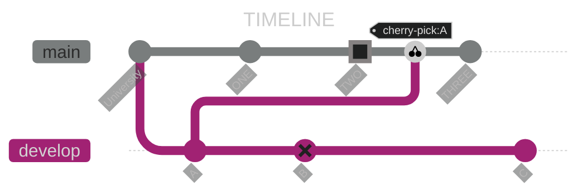
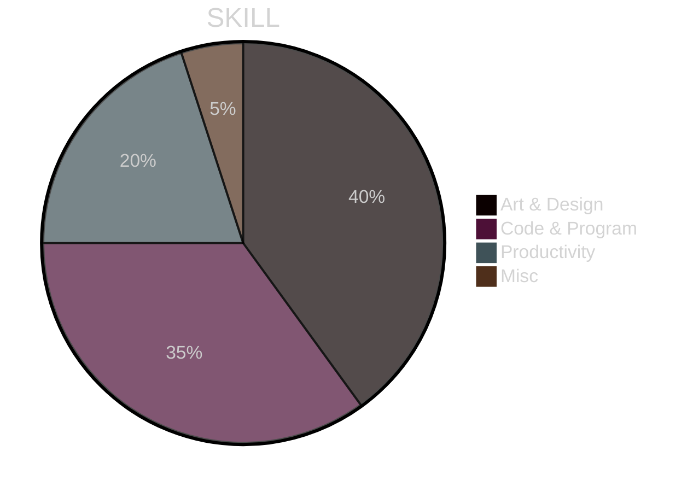
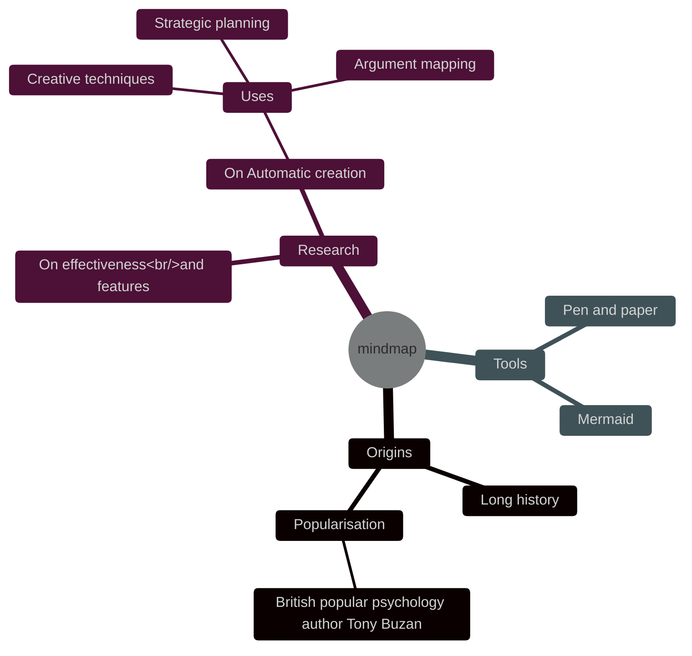

---
# BIO
	簡介
- Ceasium: painter, render and programmer. Interested in Computer Graphic, including Simulating, Rendering(video game preferred), Computational Geometry, ideal profession is Tech Artist. 

- 周明駿：画者、渲染师和程序员。兴趣方向为计算机图形，涵盖仿真、渲染（电子游戏方向）、计算几何，理想是成为技术美术. 
- ![[smallme.jpg]]

# TIMELINE
	時間軸

# SKILL
	技能
---

- ## Art & Design
	- Rendering (focus on computer graphics, with Unity[preferred], Blender, UE)
		- Vfx(Unity, Blender[preferred], Houdini).
		- Painting(on paper, comfyUI)

- ## Code & Program
	- GPU programming (hlsl[preferred]/cg/glsl)
		- Scripting(in program, with python/ts(js)/rust)
		- Back end Architecting(Java/C#[preferred]/Cpp)
		- Web(css3, react, ts(js)).

- ## Productivity
	- PM (Google Sheets/Lark/Mermaid)
		- Documentation (obsidian, markdown/latex)
		- Version control (git/svn)
		- Leadership (Gamejam experiences, Tech assistant in university)

- ## Misc
	- Music(guitar, progressive)
	- Playwriting(writing scripts for play, novels)